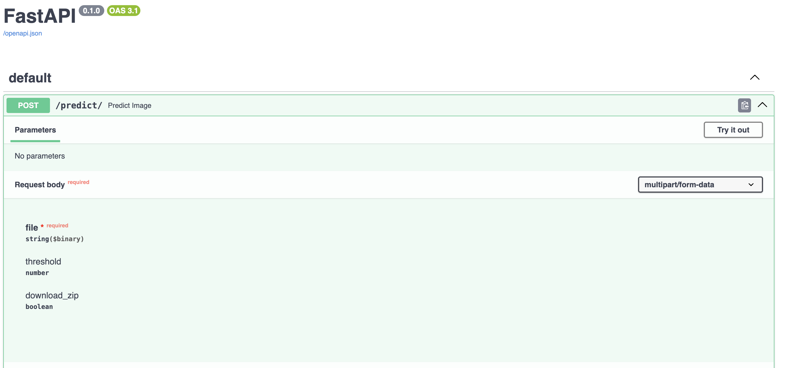

# Barcode Detection and Reading from

This project implements a FastAPI application that utilizes a a custom YOLO model for image processing and barcode detection. The application is containerized using [Docker](#https://www.docker.com/) and [Docker Compose](#https://www.docker.com/) for easy deployment.

## Table of Contents
- [Installation](#installation)
- [License](#license)

## Installation

1. **Clone the repository:**
   ```bash
   git clone https://github.com/romj99/barcode-detection-and-reading.git

   cd barcode-detection-and-reading
2. **Build and run containerized app:**
   ```bash
   docker compose up

3. Access to the endpoint in your web browser.
http://0.0.0.0:8000/docs

4. Make a prediction


## License

This project is licensed under the Apache License 2.0. See the [LICENSE](LICENSE) file for details.


