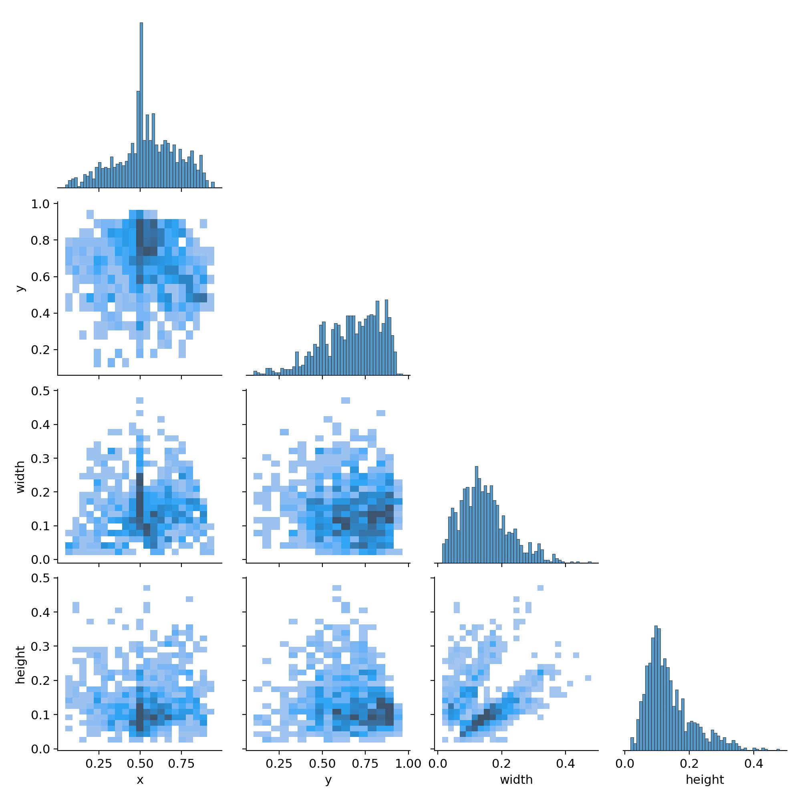
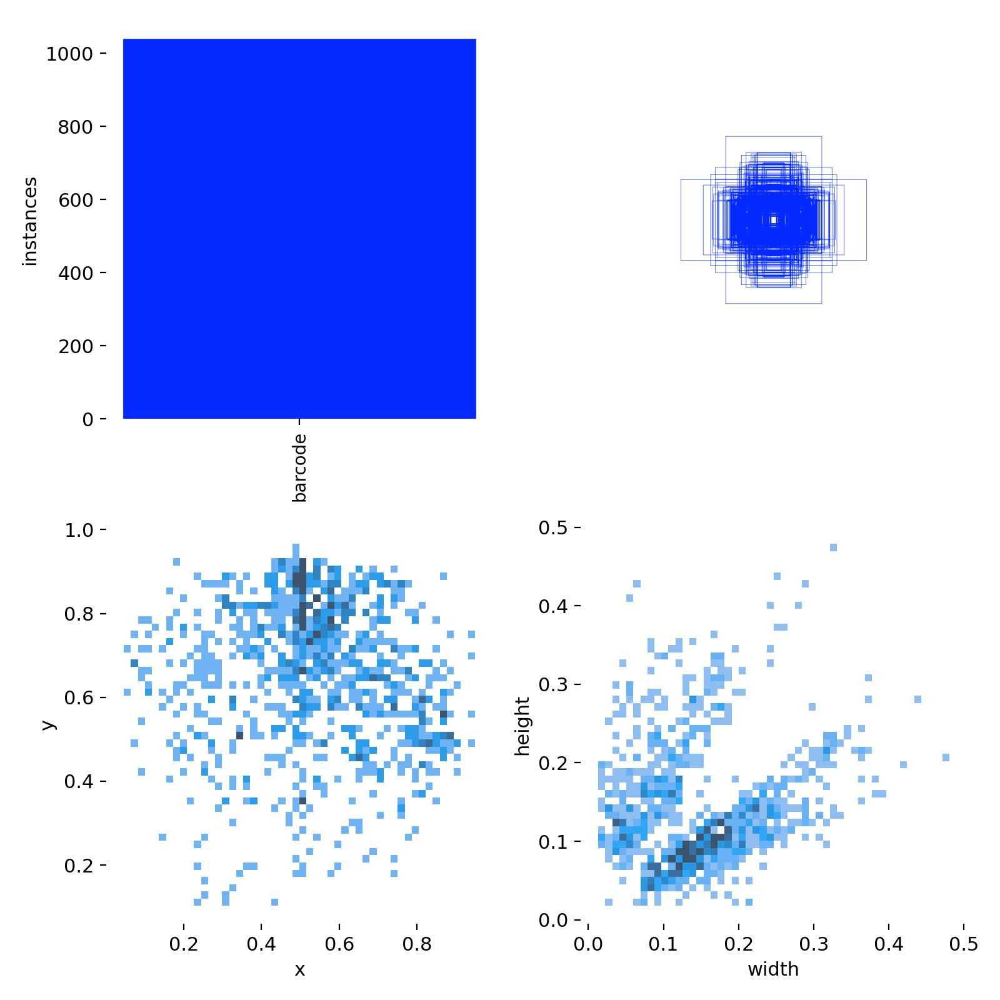
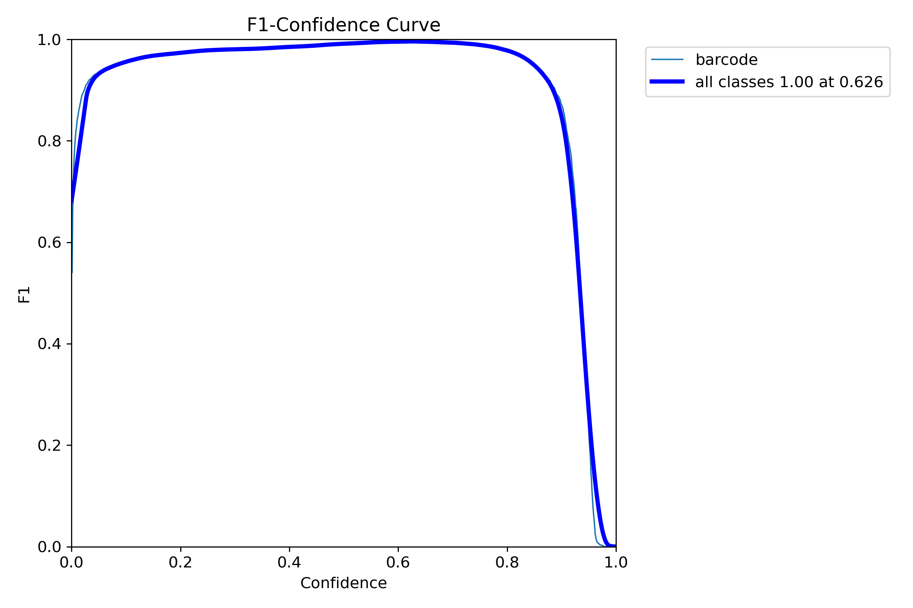
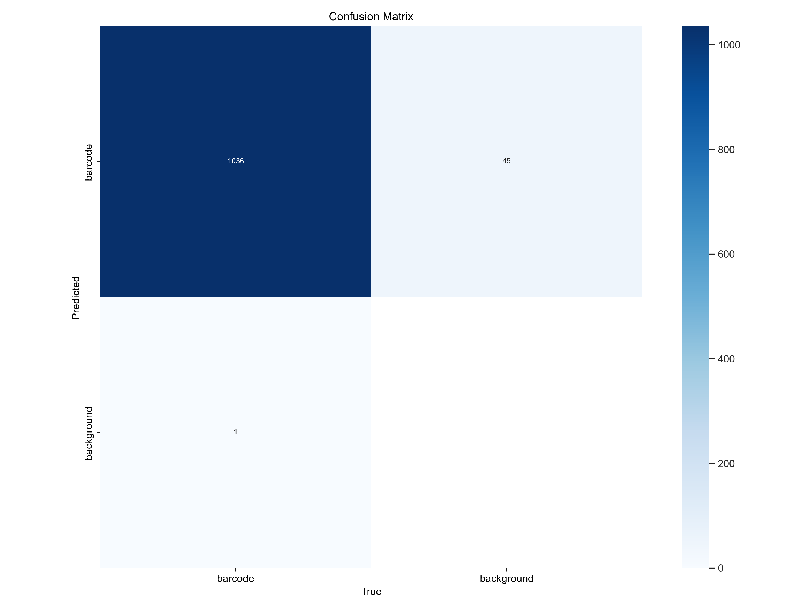
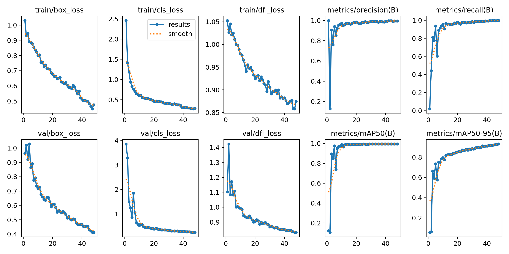
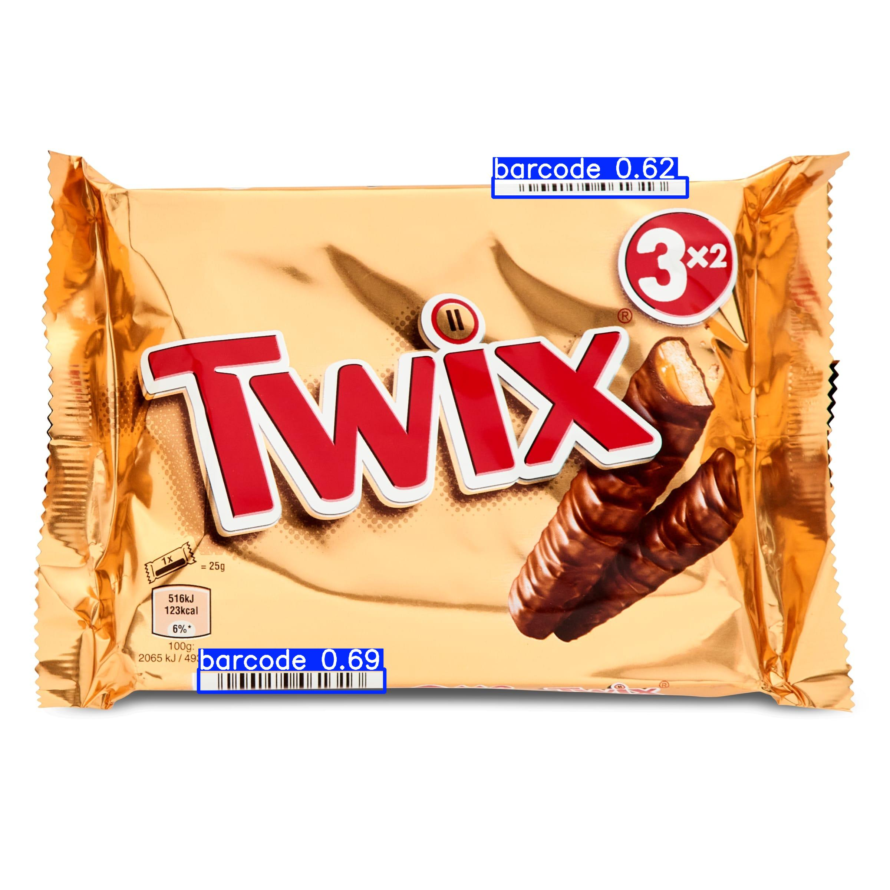
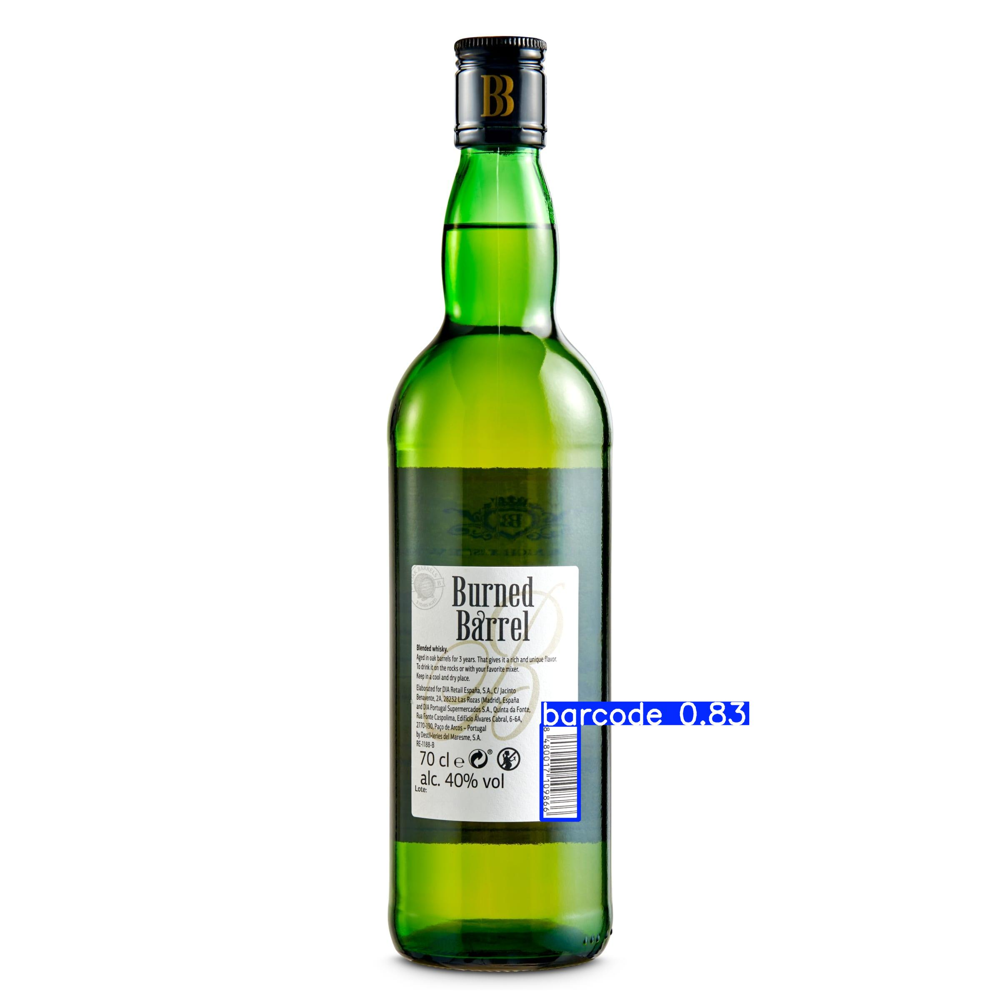
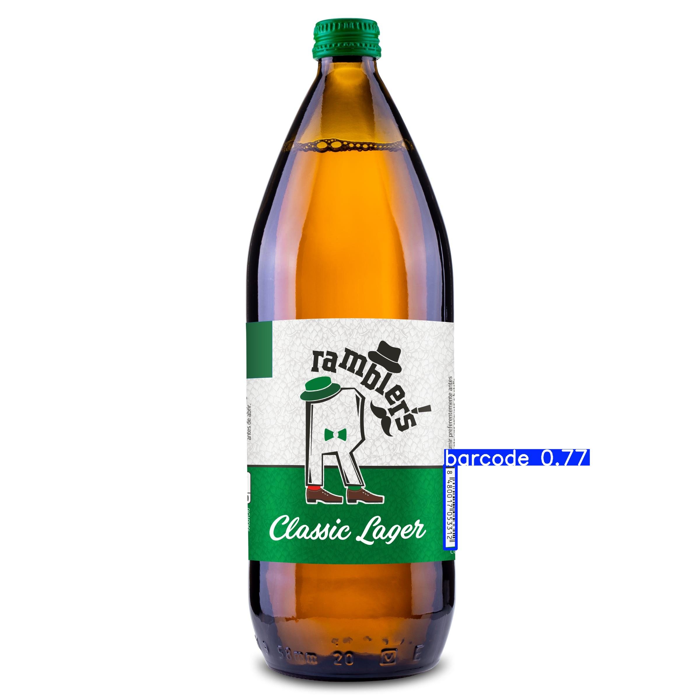

# Custom trained YOLOv8 Model for Barcode Detection - Results and Analysis

## Project Description
This project involves training a YOLOv8 object detection model to detect barcodes from product images. The model was trained using labeled 1011 images from different types of products with bounding boxes around the barcodes.

## Dataset Description
### 1. Labels Correlogram

*The labels correlogram pairplots the relationships between the annotations on the dataset, showing the distribution of the polygons in terms of coordinates x and y, height and width.*

### 2. Labels

## Model Overview
- **Model Architecture**: YOLOv8N
- **Training Dataset**: Custom labeled dataset of barcode images
- **Number of Classes**: 1 (Barcode)
- **Input Image Size**: Resized to 640x640

## Training Process
The model was trained for a total of **100 epochs** with the following hyperparameters:

- **Image Size**: 640 (input image size)
- **Device**: CPU (the training was performed on a CPU)
- **Max Training Time**: 5 hours (maximum duration allocated for training)
- **Patience**: 4 epochs (number of epochs to wait for improvement before stopping early)
- **Batch Size**: 32 (number of samples per gradient update)
- **Data Augmentation**: Enabled (dataset augmentations were applied during training)

## Results
The model was trained for a total of **48 epochs** over approximately **5.036 hours**. The following metrics summarize the performance:

- **Number of Images**: 1011
- **Number of Instances**: 1037
- **Training Completion**: 48 epochs completed

### Performance Metrics
| Metric       | Value       |
|--------------|-------------|
| Box Precision (P) | 0.993    |
| Box Recall (R)    | 0.999    |
| mAP@50       | 0.995      |
| mAP@50:95    | 0.919      |

### Inference Speed
- **Preprocessing Time**: 0.4ms per image
- **Inference Time**: 228.2ms per image
- **Postprocessing Time**: 0.2ms per image

## Training and Validation Curves
In addition to the performance metrics, the following visualizations illustrate the model's training and validation performance:

### 1. F1 Curve

*The F1 curve indicates the trade-off between precision and recall at different thresholds, showcasing the model's ability to balance false positives and false negatives.*

### 2. Confusion Matrix

*The confusion matrix shows high precision and recall for the barcode class.*

### 3. Results Visualization

*This plot shows the training loss and validation loss over epochs, providing insights into the model's learning process and convergence.*

- **box_loss**: This is the loss associated with the accuracy in predicting the coordinates of the bounding boxes. It measures how well the model fits the boxes around the detected objects.

- **cls_loss**: This is the classification loss. It evaluates how well the model classifies objects into the different available classes. If the model incorrectly predicts the class of an object, this loss increases.

- **dfl_loss**: This is the "distance focal" (DFL) loss. It refers to the quality of the prediction of the exact edges of the bounding boxes, helping to improve the accuracy in the positioning of the boxes.

- **precision(B)**: Precision measures the percentage of correct predictions made by the model out of the total predictions (true positives over the sum of true positives and false positives). A high value indicates that the model is generating fewer false positives.

- **recall(B)**: Recall measures the percentage of objects correctly detected by the model out of the total objects present in the image (true positives over the sum of true positives and false negatives). A high value means that the model is detecting most of the objects.

- **mAP50(B)**: This is the "mean Average Precision" at a 50% IoU (Intersection over Union) threshold. The IoU compares the overlap between the predicted bounding box and the actual box. The mAP50 indicates the average precision in object detection when considering a 50% overlap as correct.

- **mAP50-95(B)**: This is the "mean Average Precision" calculated at multiple IoU thresholds, ranging from 50% to 95%, in 5% increments. It measures the overall precision of the model across different levels of overlap.

## Sample Predictions
Below are some sample predictions made by the model on test images:

